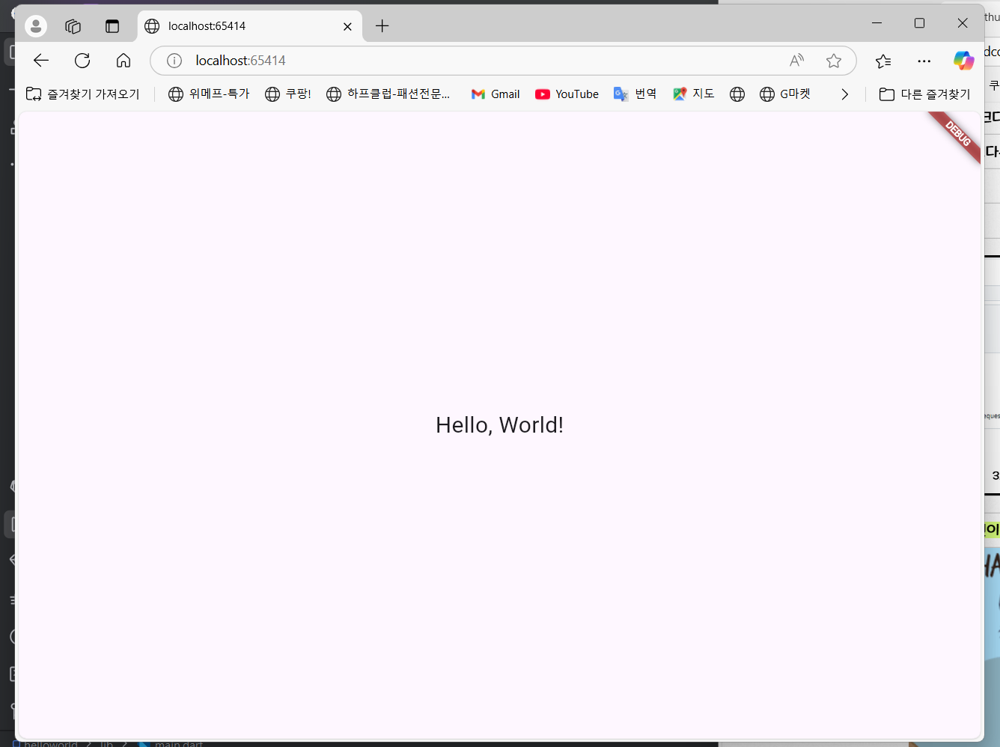

# 1주차 과제 - Flutter 개발 환경 구성 및 Hello World 실행

## 📌 개발 환경 구성
- Android Studio 설치
- Flutter 플러그인 추가
- Flutter SDK 다운로드 및 환경 변수 설정

## 📌 Hello World 실행
Flutter 프로젝트 생성 후, `main.dart` 수정하여 "Hello, World!" 출력

### 🔹 실행 화면

- [Lab: Write your first Flutter app](https://docs.flutter.dev/get-started/codelab)
- [Cookbook: Useful Flutter samples](https://docs.flutter.dev/cookbook)

For help getting started with Flutter development, view the
[online documentation](https://docs.flutter.dev/), which offers tutorials,
samples, guidance on mobile development, and a full API reference.
i
